# Test Data Set for BLE-MIDI Packet Parser

This is a data set of BLE-MIDI packets based on the BLE-MIDI specification.
It can be used to verify that the parser for BLE-MIDI packets is working properly.

## Emulate BLE MIDI Peripherals

There is a script that can emulate BLE-MIDI peripherals (such as BLE-MIDI keyboards) on a Windows PC.
The data set can be used in the emulator to verify the operation of the BLE-MIDI packet parser in BLE-MIDI Central (such as a BLE-MIDI driver or software running on another Windows PC).

[
Emulate BLE MIDI Peripherals with python bless
](https://gist.github.com/trueroad/aa2507bf64c97f34aab324d8278b5686)

### Requires

* [Python 3.9 for Windows 64-bit](https://www.python.org/downloads/windows/)
* [Bless](https://pypi.org/project/bless/)
* [Bleak](https://pypi.org/project/bleak/)

### Usage

#### 1. On PC1, run the emulator

```
> python emu_ble_midi.py BLE_MIDI_PACKET_DATA_FILE.jsonl
```

Then, PC1 begins to act as a BLE-MIDI peripheral.

#### 2. On PC2, pair with PC1's BLE-MIDI peripheral

On PC2, select Start -> Settings -> Devices -> Bluetooth & other devices -> Add Bluetooth or other devide -> Bluetooth.
Choose PC1's BLE-MIDI and follow additional instructions if they appear, then select Done.
PC1 also receives a pairing notification, so follow the instructions on PC1.

#### 3. On PC2, run the BLE-MIDI driver or software

For example, the following software can be used to check the operation of UWP MIDI.

[
WinRT MIDI IN Timing with C++/WinRT
](https://gist.github.com/trueroad/2ffa736d0b206973a80c99e177273795)

#### 4. On PC1, wait to finish sending the packet data

When the packet data has been sent out, emu_ble_midi.py exits.

#### 5. On PC2, stop the BLE-MIDI driver or software

If you are using "WinRT MIDI IN Timing with C++/WinRT", you can stop using Ctrl-C.

#### 6. On PC2, unpair with PC1

On PC2, select Start -> Settings -> Devices -> Bluetooth & other devices.
Remove all devices of PC1.

Note: You cannot use the emulator again until both PCs have unpaired each other.

#### 7. On PC1, unpair with PC2

On PC1, select Start -> Settings -> Devices -> Bluetooth & other devices.
Remove all devices of PC2.

Note: You cannot use the emulator again until both PCs have unpaired each other.

## Test data set

See
[
Specification for MIDI over Bluetooth Low Energy (BLE-MIDI) 1.0
](https://amei.or.jp/midistandardcommittee/Recommended_Practice/e/rp52spec(ble-midi).pdf)
or RP-052 in
[
RP/CA Download
](https://amei.or.jp/midistandardcommittee/RP&CAj.html)
.

### Page 3. BLE Packet with One MIDI Message

> 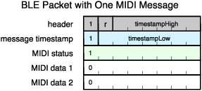

BLE MIDI packet data file:
[
p3_1_BLE_Packet_with_One_MIDI_Message.ns.jsonl
](p3_1_BLE_Packet_with_One_MIDI_Message.ns.jsonl)

Example of parse result:

```
MIDI message: e0 00 40
```

### Page 3. BLE Packet with Two MIDI Messages

> 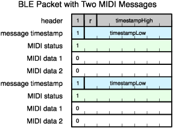

BLE MIDI packet data file:
[
p3_2_BLE_Packet_with_Two_MIDI_Messages.ns.jsonl
](p3_2_BLE_Packet_with_Two_MIDI_Messages.ns.jsonl)

Example of parse result:

```
MIDI message: 90 3c 64
Delta time  : 1 ms
MIDI message: 80 3c 5a
```

### Page 3. 2 MIDI Messages with Running Status

> 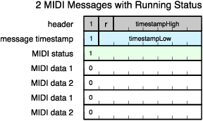

BLE MIDI packet data file:
[
p3_3_2_MIDI_Messages_with_Running_Status.ns.jsonl
](p3_3_2_MIDI_Messages_with_Running_Status.ns.jsonl)

Example of parse result:

```
MIDI message: 90 3c 64
Delta time  : 0 ms
MIDI message: 90 3c 00
```

### Page 4. Multiple MIDI Messages, mixed type

> 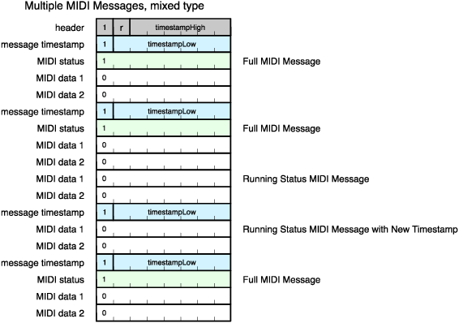

BLE MIDI packet data file:
[
p4_1_Multiple_MIDI_Message_mixed_type.ns.jsonl
](p4_1_Multiple_MIDI_Message_mixed_type.ns.jsonl)

Example of parse result:

```
MIDI message: 90 3c 64
Delta time  : 1 ms
MIDI message: 90 3c 00
Delta time  : 0 ms
MIDI message: 90 3d 5a
Delta time  : 1 ms
MIDI message: 90 3d 00
Delta time  : 1 ms
MIDI message: e0 00 40
```

### Page 4. System Messages Do Not Chancel Running Status

> 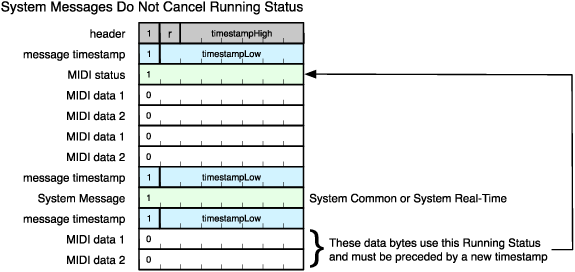

BLE MIDI packet data file:
[
p4_2_System_Messges_Do_Not_Cancel_Running_Status.ns.jsonl
](p4_2_System_Messges_Do_Not_Cancel_Running_Status.ns.jsonl)

**\*\*\*WARNING\*\*\*: Windows 10 21H2 cannot parse this correctly and produces broken results.**

Example of *correct* parse result:

```
MIDI message: e0 00 00
Delta time  : 0 ms
MIDI message: e0 7f 7f
Delta time  : 1 ms
MIDI message: fe
Delta time  : 0 ms
MIDI message: e0 00 40
```

### Page 5. MIDI Stream with System Real-Time Message in the middle of another MIDI Message

> 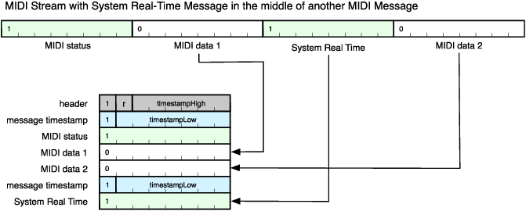

BLE MIDI packet data file:
[
p5_1_MIDI_Stream_with_System_Real-Time_Message_in_the_middle_of_another_MIDI_Message.ns.jsonl
](p5_1_MIDI_Stream_with_System_Real-Time_Message_in_the_middle_of_another_MIDI_Message.ns.jsonl)

Example of parse result:

```
MIDI message: e0 00 40
Delta time  : 1 ms
MIDI message: fe
```

### Page 6. System Exclusive Start & End in 1 Packet

> 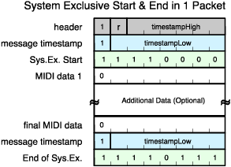

BLE MIDI packet data file:
[
p6_1_System_Exclusive_Start_and_End_in_1_Packet.ns.jsonl
](p6_1_System_Exclusive_Start_and_End_in_1_Packet.ns.jsonl)

Example of parse result (integrated):

```
MIDI message: f0 43 12 00 43 12 00 43 12 00 f7
```

Example of parse result (fragmented):

```
MIDI message fragment (1st)     : f0 43 12 00 43 12 00 43 12 00
Delta time                      : 1 ms
MIDI message fragment (2nd/last): f7
```

### Page 6. System Exclusive Split Across 2 Packets

> 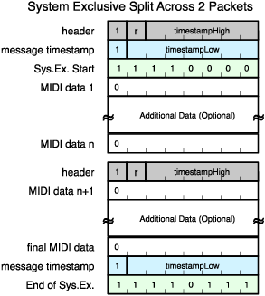

BLE MIDI packet data file:
[
p6_2_System_Exclusive_Split_Across_2_Packets.ns.jsonl
](p6_2_System_Exclusive_Split_Across_2_Packets.ns.jsonl)

Example of parse result (integrated):

```
MIDI message: f0 43 12 00 43 12 00 43 12 00 f7
```

Example of parse result (fragmented):

```
MIDI message fragment (1st)     : f0 43 12 00
Delta time                      : 0 ms
MIDI message fragment (2nd)     : 43 12 00 43 12 00
Delta time                      : 1 ms
MIDI message fragment (3rd/last): f7
```

### Page 6. System Exclusive Split Across 3 Packets

> 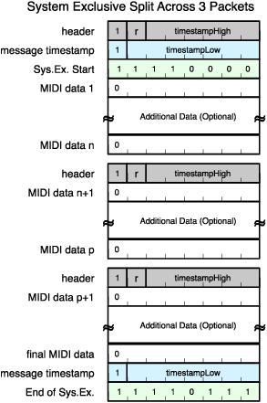

BLE MIDI packet data file:
[
p6_3_System_Exclusive_Split_Across_3_Packets.ns.jsonl
](p6_3_System_Exclusive_Split_Across_3_Packets.ns.jsonl)

Example of parse result (integrated):

```
MIDI message: f0 43 12 00 43 12 00 43 12 00 f7
```

Example of parse result (fragmented):

```
MIDI message fragment (1st)     : f0 43 12 00
Delta time                      : 0 ms
MIDI message fragment (2nd)     : 43 12 00
Delta time                      : 0 ms
MIDI message fragment (3rd)     : 43 12 00
Delta time                      : 1 ms
MIDI message fragment (4th/last): f7
```

### Page 6. System Exclusive Start & End in 1 Packet with System Real-Time

> 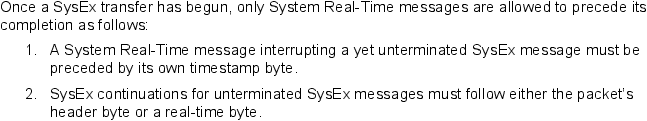

BLE MIDI packet data file:
[
p6_e1_System_Exclusive_Start_and_End_in_1_Packet_with_System_Real-time.ns.jsonl
](p6_e1_System_Exclusive_Start_and_End_in_1_Packet_with_System_Real-time.ns.jsonl)

**\*\*\*WARNING\*\*\*: Windows 10 21H2 cannot parse this and it does not appear in the results.**

Example of parse result (integrated):

```
MIDI message: f0 43 12 00 43 12 00 43 12 00 f7
Delta time  : 1 ms
MIDI message: fe
```

Example of parse result (fragmented):

```
MIDI message fragment (1st)     : f0 43 12 00
Delta time                      : 1 ms
MIDI message fragment (2nd)     : fe
Delta time                      : 0 ms
MIDI message fragment (3rd)     : 43 12 00 43 12 00
Delta time                      : 1 ms
MIDI message fragment (4th/last): f7
```

### Page 6. System Exclusive Split Across 2 Packets with System Real-Time

> 

BLE MIDI packet data file:
[
p6_e2_System_Exclusive_Split_Across_1_Packets_with_System_Real-time.ns.jsonl
](p6_e2_System_Exclusive_Split_Across_1_Packets_with_System_Real-time.ns.jsonl)

**\*\*\*WARNING\*\*\*: Windows 10 21H2 cannot parse this and it does not appear in the results.**

Example of parse result (integrated):

```
MIDI message: f0 43 12 00 43 12 00 43 12 00 f7
Delta time  : 1 ms
MIDI message: fe
Delta time  : 1 ms
MIDI message: fe
```

Example of parse result (fragmented):

```
MIDI message fragment (1st)     : f0 43
Delta time                      : 1 ms
MIDI message                    : fe
Delta time                      : 0 ms
MIDI message fragment (2nd)     : 12 00
Delta time                      : 0 ms
MIDI message fragment (3rd)     : 43 12 00
Delta time                      : 1 ms
MIDI message                    : fe
Delta time                      : 0 ms
MIDI message fragment (4th)     : 43 12 00
Delta time                      : 1 ms
MIDI message fragment (5th/last): f7
```

### Page 6. System Exclusive Split Across 3 Packets with System Real-Time

> 

BLE MIDI packet data file:
[
p6_e3_System_Exclusive_Split_Across_3_Packets_with_System_Real-time.ns.jsonl
](p6_e3_System_Exclusive_Split_Across_3_Packets_with_System_Real-time.ns.jsonl)

**\*\*\*WARNING\*\*\*: Windows 10 21H2 cannot parse this and it does not appear in the results.**

Example of parse result (integrated):

```
MIDI message: f0 43 12 00 43 12 00 43 12 00 f7
Delta time  : 1 ms
MIDI message: fe
Delta time  : 1 ms
MIDI message: fe
Delta time  : 1 ms
MIDI message: fe
```

Example of parse result (fragmented):

```
MIDI message fragment (1st)     : f0 43
Delta time                      : 1 ms
MIDI message                    : fe
Delta time                      : 0 ms
MIDI message fragment (2nd)     : 12 00
Delta time                      : 0 ms
MIDI message fragment (3rd)     : 43 12
Delta time                      : 1 ms
MIDI message                    : fe
Delta time                      : 0 ms
MIDI message fragment (4th)     : 00
Delta time                      : 0 ms
MIDI message fragment (5th)     : 43
Delta time                      : 1 ms
MIDI message                    : fe
Delta time                      : 0 ms
MIDI message fragment (6th)     : 12 00
Delta time                      : 1 ms
MIDI message fragment (7th/last): f7
```

### Page 7. Overflow high

> 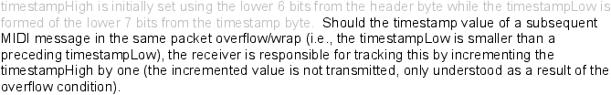

BLE MIDI packet data file:
[
p7_e1_Overflow_high.ns.jsonl
](p7_e1_Overflow_high.ns.jsonl)

Example of parse result:

```
MIDI message: 90 3c 64
Delta time  : 1 ms
MIDI message: 80 3c 5a
```

### Page 7. Overflow low

> 

BLE MIDI packet data file:
[
p7_e2_Overflow_low.ns.jsonl
](p7_e2_Overflow_low.ns.jsonl)

**\*\*\*WARNING\*\*\*: Windows 10 21H2 cannot parse this correctly and produces wrong delta time in the results.**

Example of parse result:

```
MIDI message: 90 3c 64
Delta time  : 1 ms
MIDI message: 80 3c 5a
```

### Page 7. Overflow both

> 

BLE MIDI packet data file:
[
p7_e3_Overflow_both.ns.jsonl
](p7_e3_Overflow_both.ns.jsonl)

**\*\*\*WARNING\*\*\*: Windows 10 21H2 cannot parse this correctly and produces wrong delta time in the results.**

Example of parse result:

```
MIDI message: 90 3c 64
Delta time  : 1 ms
MIDI message: 80 3c 5a
Delta time  : 1 ms
MIDI message: 90 3c 50
Delta time  : 1 ms
MIDI message: 80 3c 46
```
